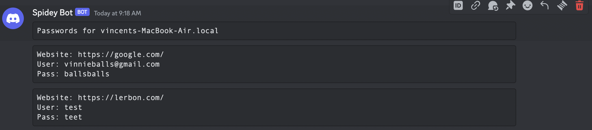
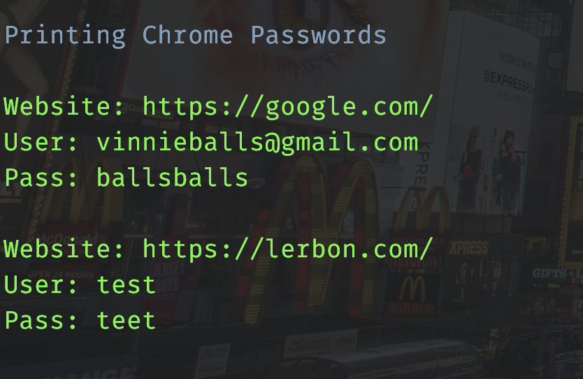
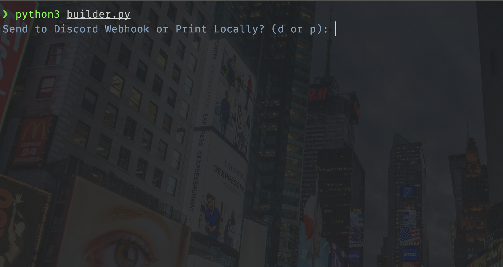

# Opera and Chrome Password Decryptor

This Python script allows you to decrypt and display saved passwords from Opera GX and Google Chrome on macOS. It retrieves and decrypts the stored login data using the Safe Storage Key from the system keychain.

## Prerequisites

Before running the script, ensure the following:

- **Python:** Make sure you have Python installed on your macOS system.
- **OpenSSL:** Ensure that OpenSSL is available on your system. On macOS, it is usually pre-installed.

## Usage

1. **Run the Script:**
   Open a terminal and run the builder script by executing the following command:

   ```bash
   python builder.py
   ```

2. **Execution:**
  After the executable has been generated, you can either right click to execute it, or in the terminal ```./executable```

## Screenshots

### Discord



### Local



### Builder



## How It Works

1. **Locate Login Data Files:**
   The script searches for the login data files of Opera GX and Google Chrome in the default user directories.

2. **Retrieve Safe Storage Keys:**
   It retrieves the Safe Storage Keys for both browsers from the macOS keychain using the `security` command.

3. **Password Decryption:**
   The script uses OpenSSL to decrypt the passwords using AES-128-CBC encryption with a 16-byte IV (Initialization Vector) and a key derived from the Safe Storage Key.

4. **Display Decrypted Passwords:**
   Finally, it prints the decrypted information, including the website, username, and password for each stored login.

## Notes

- The script utilizes the `subprocess` module to interact with the system commands and OpenSSL for decryption.
- It employs the SQLite library to connect to the login data databases of Opera GX and Google Chrome.

## Known Issues

- Will get an SQLITE database locked error, mitigate this by closing the Chromium Apps themselves

## Disclaimer

This script is intended for educational and personal use only. Do not use it for any unauthorized or malicious activities. The retrieval of passwords without user consent is against ethical guidelines. Use it responsibly and only on your own accounts.

## Author

- Made by Vincent Ng, contact me at [vinnie5224@gmail.com](mailto:vinnie5224@gmail.com)
